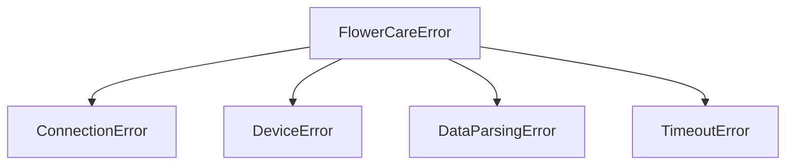

# Exceptions

The FlowerCare library provides a comprehensive exception hierarchy to help you handle different error conditions gracefully. All exceptions inherit from a common base class and provide meaningful error messages.

::: flowercare.exceptions

## Exception Hierarchy



## Base Exception

### `FlowerCareError`
```python
class FlowerCareError(Exception):
    """Base exception for FlowerCare library."""
```

The base exception class for all FlowerCare-related errors. Use this to catch any error from the library:

```python
from flowercare.exceptions import FlowerCareError

try:
    async with device:
        data = await device.read_sensor_data()
except FlowerCareError as e:
    print(f"FlowerCare operation failed: {e}")
```

## Specific Exceptions

### `ConnectionError`
```python
class ConnectionError(FlowerCareError):
    """Raised when connection to device fails."""
```

Raised when Bluetooth connection operations fail. This includes:
- Initial connection attempts
- Connection timeouts
- Bluetooth adapter issues
- Device not in range
- Device already connected to another app

**Common Causes:**
- Device is too far away (>10 meters)
- Bluetooth adapter not working
- Device battery is dead
- Device connected to another application
- Bluetooth permissions not granted

**Example Usage:**
```python
from flowercare.exceptions import ConnectionError

try:
    await device.connect(timeout=10.0)
except ConnectionError as e:
    print(f"Could not connect to device: {e}")
    
    # Possible recovery actions:
    # 1. Check device proximity
    # 2. Verify Bluetooth is enabled
    # 3. Try connecting to a different device
    # 4. Increase timeout
```

**Recovery Strategies:**
```python
async def robust_connect(device, max_retries=3):
    """Connect with retry logic"""
    for attempt in range(max_retries):
        try:
            await device.connect(timeout=15.0)
            return True
        except ConnectionError as e:
            print(f"Connection attempt {attempt + 1} failed: {e}")
            if attempt < max_retries - 1:
                await asyncio.sleep(2 ** attempt)  # Exponential backoff
            else:
                print("All connection attempts failed")
                return False
    return False
```

### `DeviceError`
```python
class DeviceError(FlowerCareError):
    """Raised when device operation fails."""
```

Raised when the device is connected but operations fail. This includes:
- Failed sensor readings
- Device not responding to commands
- Invalid device state
- Hardware malfunction

**Common Causes:**
- Device firmware issues
- Hardware malfunction
- Device in unknown state
- Invalid command sequence
- Device busy with other operations

**Example Usage:**
```python
from flowercare.exceptions import DeviceError

try:
    async with device:
        data = await device.read_sensor_data()
        await device.blink_led()
except DeviceError as e:
    print(f"Device operation failed: {e}")
    
    # Possible recovery actions:
    # 1. Retry the operation
    # 2. Reconnect to device
    # 3. Check device battery level
    # 4. Try a different operation
```

**Diagnostic Approach:**
```python
async def diagnose_device_issue(device):
    """Diagnose and categorize device issues"""
    try:
        async with device:
            # Test basic connectivity
            info = await device.get_device_info()
            print(f"Device info read successfully: {info.name}")
            
            # Test sensor reading
            data = await device.read_sensor_data()
            print(f"Sensor data read successfully: {data.temperature}°C")
            
            # Test LED control
            await device.blink_led()
            print("LED control successful")
            
            return "Device is working normally"
            
    except DeviceError as e:
        error_msg = str(e).lower()
        
        if "timeout" in error_msg:
            return "Device is not responding - may be in low power mode"
        elif "invalid" in error_msg:
            return "Device returned invalid data - possible firmware issue"
        elif "busy" in error_msg:
            return "Device is busy - try again in a few seconds"
        else:
            return f"Unknown device issue: {e}"
    except Exception as e:
        return f"Unexpected error: {e}"

diagnosis = await diagnose_device_issue(device)
print(f"Diagnosis: {diagnosis}")
```

### `DataParsingError`
```python
class DataParsingError(FlowerCareError):
    """Raised when sensor data parsing fails."""
```

Raised when sensor data received from the device cannot be parsed correctly. This indicates:
- Corrupted data transmission
- Unexpected data format
- Firmware compatibility issues
- Hardware sensor malfunction

**Common Causes:**
- Bluetooth interference causing data corruption
- Firmware version incompatibility
- Hardware sensor failure
- Device in unexpected state

**Example Usage:**
```python
from flowercare.exceptions import DataParsingError

try:
    async with device:
        data = await device.read_sensor_data()
        print(f"Temperature: {data.temperature}°C")
except DataParsingError as e:
    print(f"Could not parse sensor data: {e}")
    
    # Possible recovery actions:
    # 1. Retry reading data
    # 2. Check device firmware version
    # 3. Move closer to device (reduce interference)
    # 4. Try reading device info instead
```

**Data Validation Approach:**
```python
async def validate_sensor_data(device, max_retries=3):
    """Read and validate sensor data with retries"""
    
    for attempt in range(max_retries):
        try:
            async with device:
                data = await device.read_sensor_data()
                
                # Additional validation
                if not (-20 <= data.temperature <= 70):
                    raise DataParsingError(f"Temperature out of range: {data.temperature}")
                
                if not (0 <= data.moisture <= 100):
                    raise DataParsingError(f"Moisture out of range: {data.moisture}")
                
                if not (0 <= data.brightness <= 200000):
                    raise DataParsingError(f"Brightness out of range: {data.brightness}")
                
                return data
                
        except DataParsingError as e:
            print(f"Data validation failed (attempt {attempt + 1}): {e}")
            if attempt < max_retries - 1:
                await asyncio.sleep(1)
            else:
                raise
    
    return None

# Usage
try:
    data = await validate_sensor_data(device)
    print(f"Valid data: {data}")
except DataParsingError:
    print("Could not get valid sensor data after multiple attempts")
```

### `TimeoutError`
```python
class TimeoutError(FlowerCareError):
    """Raised when operation times out."""
```

Raised when operations take longer than the specified timeout. This can occur during:
- Device scanning
- Connection attempts
- Data reading operations
- Historical data retrieval

**Common Causes:**
- Device is very far away
- High Bluetooth interference
- Device low battery affecting performance
- Network congestion
- Device busy with other operations

**Example Usage:**
```python
from flowercare.exceptions import TimeoutError

try:
    # Scanner timeout
    devices = await scanner.scan_for_devices(timeout=10.0)
    
    # Connection timeout
    async with device.connect(timeout=15.0):
        data = await device.read_sensor_data()
        
except TimeoutError as e:
    print(f"Operation timed out: {e}")
    
    # Possible recovery actions:
    # 1. Increase timeout value
    # 2. Move closer to device
    # 3. Check for Bluetooth interference
    # 4. Try again later
```

**Adaptive Timeout Strategy:**
```python
async def adaptive_operation(operation_func, initial_timeout=5.0, max_timeout=30.0):
    """Perform operation with adaptive timeout"""
    
    timeout = initial_timeout
    
    while timeout <= max_timeout:
        try:
            return await asyncio.wait_for(operation_func(), timeout=timeout)
            
        except TimeoutError:
            print(f"Operation timed out after {timeout}s, trying {timeout * 2}s")
            timeout *= 2
            
        except asyncio.TimeoutError:
            print(f"Operation timed out after {timeout}s, trying {timeout * 2}s")
            timeout *= 2
    
    raise TimeoutError(f"Operation failed after maximum timeout of {max_timeout}s")

# Usage
async def scan_operation():
    return await scanner.scan_for_devices(timeout=60.0)

devices = await adaptive_operation(scan_operation)
```

## Error Handling Patterns

### Comprehensive Error Handling

```python
from flowercare.exceptions import (
    FlowerCareError,
    ConnectionError,
    DeviceError, 
    DataParsingError,
    TimeoutError
)

async def robust_device_operation(device):
    """Handle all possible error conditions"""
    
    try:
        async with device:
            # Get device information
            try:
                info = await device.get_device_info()
                print(f"Connected to {info.name} (Battery: {info.battery_level}%)")
            except DeviceError:
                print("Could not read device info, but connection is working")
            
            # Read sensor data
            data = await device.read_sensor_data()
            return data
            
    except ConnectionError as e:
        print(f"Connection failed: {e}")
        return None
        
    except TimeoutError as e:
        print(f"Operation timed out: {e}")
        return None
        
    except DataParsingError as e:
        print(f"Invalid data received: {e}")
        # Could retry or return cached data
        return None
        
    except DeviceError as e:
        print(f"Device error: {e}")
        return None
        
    except FlowerCareError as e:
        print(f"Unexpected FlowerCare error: {e}")
        return None
        
    except Exception as e:
        print(f"Unexpected system error: {e}")
        return None

# Usage
data = await robust_device_operation(device)
if data:
    print(f"Success: {data}")
else:
    print("Operation failed")
```

### Retry Mechanisms

```python
async def retry_with_backoff(operation, max_retries=3, base_delay=1.0):
    """Retry operation with exponential backoff"""
    
    last_exception = None
    
    for attempt in range(max_retries):
        try:
            return await operation()
            
        except (ConnectionError, TimeoutError, DeviceError) as e:
            last_exception = e
            if attempt < max_retries - 1:
                delay = base_delay * (2 ** attempt)
                print(f"Attempt {attempt + 1} failed: {e}")
                print(f"Retrying in {delay}s...")
                await asyncio.sleep(delay)
            else:
                print(f"All {max_retries} attempts failed")
                
        except (DataParsingError, FlowerCareError) as e:
            # Don't retry these errors
            print(f"Non-retryable error: {e}")
            raise
    
    # Re-raise the last exception if all retries failed
    raise last_exception

# Usage
async def read_data_operation():
    async with device:
        return await device.read_sensor_data()

try:
    data = await retry_with_backoff(read_data_operation, max_retries=3)
    print(f"Data: {data}")
except FlowerCareError as e:
    print(f"Operation failed permanently: {e}")
```

### Error Recovery Strategies

```python
class DeviceManager:
    def __init__(self):
        self.known_devices = {}  # MAC -> last known good data
        self.error_counts = {}   # MAC -> error count
        
    async def read_device_data(self, device, use_cache=True):
        """Read data with error recovery and caching"""
        mac = device.mac_address
        
        try:
            async with device:
                data = await device.read_sensor_data()
                
                # Success - reset error count and cache data
                self.error_counts[mac] = 0
                self.known_devices[mac] = {
                    'data': data,
                    'timestamp': datetime.now(),
                    'status': 'success'
                }
                return data
                
        except ConnectionError:
            # Device unreachable - use cached data if available
            if use_cache and mac in self.known_devices:
                cached = self.known_devices[mac]
                age_minutes = (datetime.now() - cached['timestamp']).total_seconds() / 60
                
                if age_minutes < 60:  # Use cache if less than 1 hour old
                    print(f"Using cached data ({age_minutes:.1f} min old)")
                    return cached['data']
            
            self.error_counts[mac] = self.error_counts.get(mac, 0) + 1
            print(f"Device {mac} unreachable (error count: {self.error_counts[mac]})")
            
            if self.error_counts[mac] >= 5:
                print(f"Device {mac} has failed {self.error_counts[mac]} times - may be offline")
            
            return None
            
        except DataParsingError as e:
            print(f"Data parsing failed for {mac}: {e}")
            # Could implement data correction logic here
            return None
            
        except DeviceError as e:
            print(f"Device {mac} hardware issue: {e}")
            self.error_counts[mac] = self.error_counts.get(mac, 0) + 1
            return None
            
        except FlowerCareError as e:
            print(f"Unexpected error with {mac}: {e}")
            return None
    
    def get_device_health(self, mac_address):
        """Get device health status based on error history"""
        error_count = self.error_counts.get(mac_address, 0)
        
        if error_count == 0:
            return "healthy"
        elif error_count < 3:
            return "warning"
        else:
            return "critical"

# Usage
manager = DeviceManager()

for device in devices:
    data = await manager.read_device_data(device)
    health = manager.get_device_health(device.mac_address)
    
    print(f"Device {device.mac_address}: {health}")
    if data:
        print(f"  Data: {data}")
    else:
        print(f"  No data available")
```

### Logging Integration

```python
import logging
from flowercare.exceptions import FlowerCareError

logger = logging.getLogger(__name__)

async def logged_device_operation(device):
    """Device operation with comprehensive logging"""
    
    logger.info(f"Starting operation on device {device.mac_address}")
    
    try:
        async with device:
            logger.debug("Device connected successfully")
            
            info = await device.get_device_info()
            logger.info(f"Device info: {info.name}, Battery: {info.battery_level}%")
            
            data = await device.read_sensor_data()
            logger.info(f"Sensor data: {data.temperature}°C, {data.moisture}%")
            
            return data
            
    except ConnectionError as e:
        logger.error(f"Connection failed for {device.mac_address}: {e}")
        raise
        
    except TimeoutError as e:
        logger.warning(f"Timeout for {device.mac_address}: {e}")
        raise
        
    except DataParsingError as e:
        logger.error(f"Data parsing failed for {device.mac_address}: {e}")
        raise
        
    except DeviceError as e:
        logger.error(f"Device error for {device.mac_address}: {e}")
        raise
        
    except FlowerCareError as e:
        logger.critical(f"Unexpected FlowerCare error for {device.mac_address}: {e}")
        raise
        
    finally:
        logger.debug(f"Operation completed for device {device.mac_address}")

# Usage with proper logging setup
logging.basicConfig(level=logging.INFO)
try:
    data = await logged_device_operation(device)
except FlowerCareError:
    logger.error("Operation failed - check logs for details")
```

## Testing Error Conditions

```python
import pytest
from unittest.mock import Mock, AsyncMock
from flowercare.exceptions import ConnectionError, DeviceError

@pytest.mark.asyncio
async def test_connection_error_handling():
    """Test proper handling of connection errors"""
    
    # Mock device that always fails to connect
    mock_device = Mock()
    mock_device.connect = AsyncMock(side_effect=ConnectionError("Device not found"))
    
    # Test error handling
    try:
        await mock_device.connect()
        assert False, "Should have raised ConnectionError"
    except ConnectionError as e:
        assert "Device not found" in str(e)

@pytest.mark.asyncio 
async def test_device_error_recovery():
    """Test recovery from device errors"""
    
    call_count = 0
    
    async def failing_read():
        nonlocal call_count
        call_count += 1
        if call_count < 3:
            raise DeviceError("Temporary failure")
        return Mock(temperature=23.5, moisture=45)
    
    # Test retry logic
    result = await retry_with_backoff(failing_read, max_retries=3, base_delay=0.1)
    assert result.temperature == 23.5
    assert call_count == 3
```

This comprehensive exception handling system ensures your FlowerCare applications can gracefully handle all error conditions and provide meaningful feedback to users.