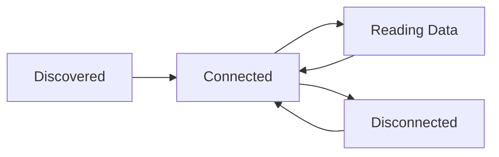

# First Steps

Now that you have the library installed and working, let's dive deeper into the core concepts and patterns you'll use throughout your FlowerCare projects.

## Core Concepts

### Async Programming

The FlowerCare library is built around Python's `asyncio` framework. This allows multiple devices to be managed simultaneously without blocking operations.

```python
import asyncio

# Basic pattern
async def my_function():
    # Use 'await' for library calls
    devices = await scanner.scan_for_devices()
    data = await device.read_sensor_data()

# Always run with asyncio
asyncio.run(my_function())
```

!!! tip "Why Async?"
    Bluetooth operations can take time (scanning, connecting, data transfer). Async programming lets your code do other things while waiting, making it much more efficient for multiple devices.

### Device Lifecycle

Every FlowerCare device follows this lifecycle:



#### 1. Discovery
```python
scanner = FlowerCareScanner()
devices = await scanner.scan_for_devices(timeout=10.0)
```

#### 2. Connection
```python
# Manual connection
await device.connect()
# ... use device ...
await device.disconnect()

# Automatic with context manager (recommended)
async with device:
    # ... use device ...
    pass  # Automatically disconnects
```

#### 3. Data Operations
```python
async with device:
    # Device info (cached after first read)
    info = await device.get_device_info()
    
    # Real-time sensor data
    data = await device.read_sensor_data()
    
    # Historical data
    history = await device.get_historical_data()
    
    # LED control
    await device.blink_led()
```

## Understanding Sensor Data

### Data Structure

All sensor readings use the `SensorData` class:

```python
from flowercare.models import SensorData

# Reading data
data = await device.read_sensor_data()

# Accessing values
print(f"Temperature: {data.temperature}°C")      # float
print(f"Brightness: {data.brightness} lux")      # int
print(f"Moisture: {data.moisture}%")             # int (0-100)
print(f"Conductivity: {data.conductivity} µS/cm") # int
print(f"Measured at: {data.timestamp}")          # datetime
```

### Data Ranges and Meaning

| Sensor | Range | Good Values | Notes |
|--------|-------|-------------|-------|
| **Temperature** | -10°C to 60°C | 18-24°C for most plants | Air temperature near plant |
| **Brightness** | 0 to 120,000 lux | 10,000-50,000 for most plants | Direct sunlight ≈ 100,000 lux |
| **Soil Moisture** | 0% to 100% | 30-70% for most plants | 0% = bone dry, 100% = waterlogged |
| **Conductivity** | 0 to 10,000 µS/cm | 500-2000 µS/cm | Higher = more nutrients |

### Interpreting Readings

```python
def analyze_plant_health(data: SensorData) -> str:
    issues = []
    
    if data.temperature < 15:
        issues.append("Too cold")
    elif data.temperature > 30:
        issues.append("Too hot")
    
    if data.brightness < 1000:
        issues.append("Not enough light")
    
    if data.moisture < 20:
        issues.append("Needs water")
    elif data.moisture > 80:
        issues.append("Overwatered")
    
    if data.conductivity < 200:
        issues.append("Needs fertilizer")
    
    return "Healthy plant!" if not issues else ", ".join(issues)

# Usage
data = await device.read_sensor_data()
health = analyze_plant_health(data)
print(f"Plant status: {health}")
```

## Error Handling Best Practices

The library provides specific exception types for different scenarios:

```python
from flowercare.exceptions import (
    FlowerCareError,    # Base exception
    ConnectionError,    # Bluetooth connection issues
    DeviceError,        # Device operation failures
    DataParsingError,   # Invalid data from device
    TimeoutError        # Operation timeouts
)

async def robust_data_reading(device):
    try:
        async with device:
            return await device.read_sensor_data()
            
    except ConnectionError:
        print("Could not connect to device - check Bluetooth and proximity")
        return None
        
    except TimeoutError:
        print("Operation timed out - device may be busy")
        return None
        
    except DeviceError as e:
        print(f"Device reported error: {e}")
        return None
        
    except FlowerCareError as e:
        print(f"Unexpected library error: {e}")
        return None
```

### Retry Patterns

For production use, implement retry logic:

```python
import asyncio
from typing import Optional

async def read_with_retry(device, max_retries: int = 3) -> Optional[SensorData]:
    for attempt in range(max_retries):
        try:
            async with device:
                return await device.read_sensor_data()
                
        except (ConnectionError, TimeoutError) as e:
            if attempt == max_retries - 1:
                print(f"Failed after {max_retries} attempts: {e}")
                return None
            
            wait_time = 2 ** attempt  # Exponential backoff
            print(f"Attempt {attempt + 1} failed, retrying in {wait_time}s...")
            await asyncio.sleep(wait_time)
    
    return None
```

## Device Management Patterns

### Working with Multiple Devices

```python
async def read_all_devices(devices):
    """Read data from multiple devices concurrently"""
    
    async def read_one_device(device):
        try:
            async with device:
                data = await device.read_sensor_data()
                return device.name, data
        except FlowerCareError as e:
            return device.name, f"Error: {e}"
    
    # Run all reads concurrently
    results = await asyncio.gather(*[
        read_one_device(device) for device in devices
    ], return_exceptions=True)
    
    return results

# Usage
devices = await scanner.scan_for_devices()
results = await read_all_devices(devices)

for name, data in results:
    print(f"{name}: {data}")
```

### Device Identification

```python
# Find specific device by MAC address
target_device = await scanner.find_device_by_mac("C4:7C:8D:6A:8E:CA")

# Or by name pattern
devices = await scanner.scan_for_devices()
garden_devices = [d for d in devices if "Garden" in d.name]

# Label devices for easy identification
device_labels = {
    "C4:7C:8D:6A:8E:CA": "Living Room Fiddle Leaf Fig",
    "C4:7C:8D:6B:8F:CB": "Kitchen Herb Garden",
    "C4:7C:8D:6C:90:CC": "Bedroom Snake Plant"
}

for device in devices:
    label = device_labels.get(device.mac_address, device.name)
    print(f"Reading {label}...")
```

## Data Collection Strategies

### Single Reading
```python
# Quick one-off reading
data = await device.read_sensor_data()
print(data)
```

### Periodic Monitoring
```python
async def monitor_plant(device, interval_minutes=30):
    """Monitor a plant with regular readings"""
    
    while True:
        try:
            async with device:
                data = await device.read_sensor_data()
                timestamp = data.timestamp.strftime("%H:%M:%S")
                print(f"[{timestamp}] {data}")
                
        except FlowerCareError as e:
            print(f"Monitoring error: {e}")
            
        # Wait before next reading
        await asyncio.sleep(interval_minutes * 60)

# Start monitoring
await monitor_plant(device, interval_minutes=15)
```

### Historical Data Analysis
```python
async def analyze_plant_trends(device):
    """Analyze historical data for trends"""
    
    async with device:
        history = await device.get_historical_data()
        
    if not history:
        print("No historical data available")
        return
    
    # Calculate averages
    temps = [entry.sensor_data.temperature for entry in history]
    moistures = [entry.sensor_data.moisture for entry in history]
    
    avg_temp = sum(temps) / len(temps)
    avg_moisture = sum(moistures) / len(moistures)
    
    print(f"Historical averages:")
    print(f"  Temperature: {avg_temp:.1f}°C")
    print(f"  Moisture: {avg_moisture:.1f}%")
    
    # Find extremes
    min_moisture = min(moistures)
    max_temp = max(temps)
    
    print(f"Extremes:")
    print(f"  Driest: {min_moisture}%")
    print(f"  Hottest: {max_temp}°C")
```

## Configuration and Logging

### Logging Configuration
```python
from flowercare.logging import setup_logging, disable_bleak_logs

# Different log levels for different scenarios
setup_logging("DEBUG")    # Development - see everything
setup_logging("INFO")     # Production - important events only
setup_logging("WARNING")  # Quiet - only problems

# Disable noisy Bluetooth logs
disable_bleak_logs()

# Custom logging format
setup_logging(
    level="INFO",
    format_string="%(asctime)s [%(levelname)s] %(message)s",
    include_timestamp=True
)
```

### Performance Tips

1. **Reuse scanners**: Create one scanner and reuse it
2. **Batch operations**: Read multiple devices concurrently
3. **Connection pooling**: Keep connections open for frequent reads
4. **Cache device info**: Device info rarely changes

```python
# Good: Reuse scanner
scanner = FlowerCareScanner()
devices1 = await scanner.scan_for_devices()
devices2 = await scanner.scan_for_devices()  # Reuses same scanner

# Good: Concurrent reads
results = await asyncio.gather(*[
    device.read_sensor_data() for device in devices
])

# Good: Keep connection open for multiple operations
async with device:
    info = await device.get_device_info()
    data = await device.read_sensor_data()
    await device.blink_led()
```

## Next Steps

You now understand the fundamentals! Continue with:

- **[Device Discovery](../user-guide/device-discovery.md)**: Advanced scanning techniques
- **[Reading Sensor Data](../user-guide/reading-data.md)**: Deep dive into sensor measurements
- **[Examples](../examples/basic-usage.md)**: Complete working examples
- **[API Reference](../api/device.md)**: Detailed API documentation